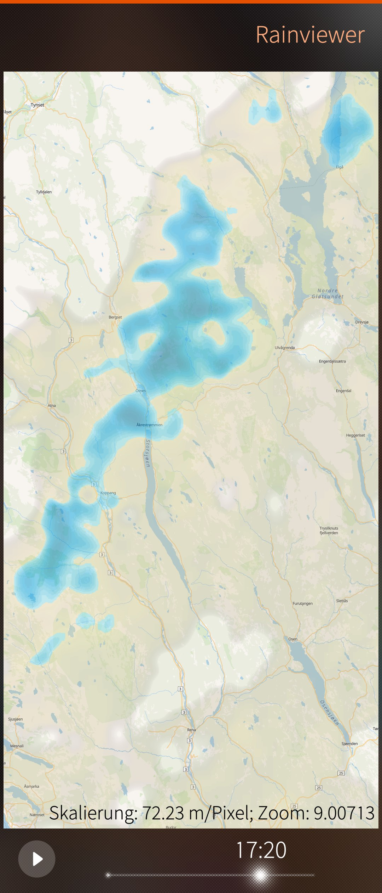
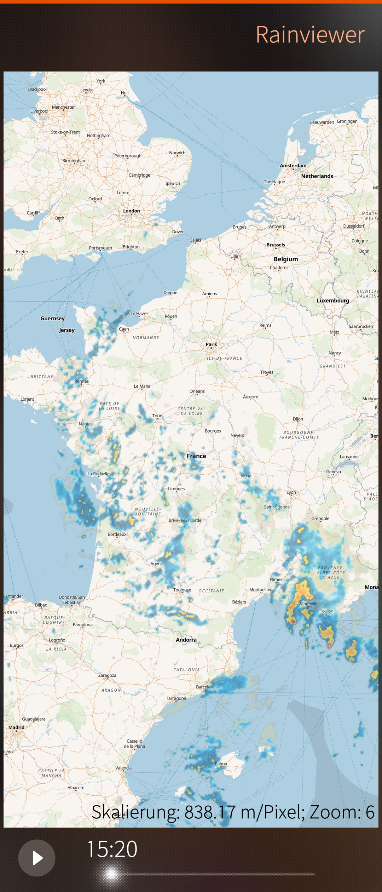
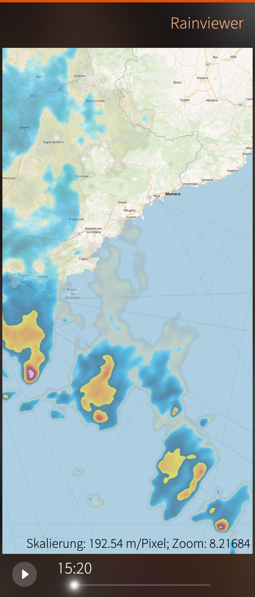
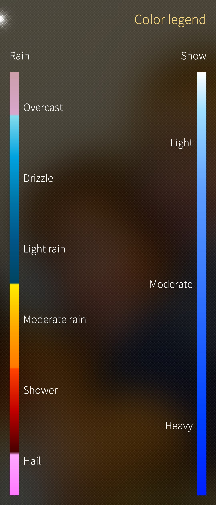

# harbour-rainviewer

A simple rain radar app for SailfishOS with the data from [rainviewer.com](https://rainviewer.com).

Installable via [Chum](https://build.sailfishos.org/package/show/sailfishos:chum:testing/harbour-rainviewer) and [OpenRepos](https://openrepos.net/content/cnlpete/rainviewer).

## Screenshots

|  |  |  |  |
|     :---:      |     :---:      |     :---:      |     :---:      |

